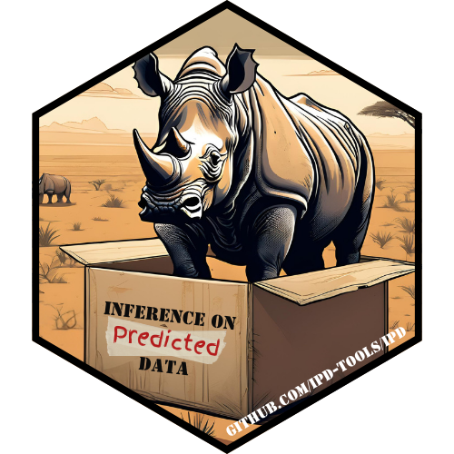

# Inference with Predicted Data (IPD) Workshop

## 

> What do we do after we have machine learned everything?

**Presenters:**
    Stephen Salerno^[[ssalerno@fredhutch.org](mailto:ssalerno@fredhutch.org)]

**Contributors (Alphabetical Order):**
    Awan Afiaz^[[aafiaz@uw.edu](mailto:aafiaz@uw.edu)],
    David Cheng^[[dcheng@mgh.harvard.edu](mailto:dcheng@mgh.harvard.edu)],
    Jianhui Gao^[[jianhui.gao@mail.utoronto.ca](mailto:jianhui.gao@mail.utoronto.ca)], 
    Jesse Gronsbell^[[j.gronsbell@utoronto.ca](mailto:j.gronsbell@utoronto.ca)],
    Kentaro Hoffman^[[khoffm3@uw.edu](mailto:khoffm3@uw.edu)],
    Jeff Leek^[[jtleek@fredhutch.org](mailto:jtleek@fredhutch.org)],
    Qiongshi Lu^[[qlu@biostat.wisc.edu](mailto:qlu@biostat.wisc.edu)],
    Tyler McCormick^[[tylermc@uw.edu](mailto:tylermc@uw.edu)],
    Jiacheng Miao^[[jmiao24@wisc.edu](mailto:jmiao24@wisc.edu)],     
    Anna Neufeld^[[acn2@williams.edu](mailto:acn2@williams.edu)],
    Stephen Salerno^[[ssalerno@fredhutch.org](mailto:ssalerno@fredhutch.org)]

**Workshop Date:** June 24, 2025

---

## Background and Motivation

Artificial intelligence and machine learning (AI/ML) have become essential 
tools in biomedical research, enabling large-scale analyses across diverse 
domains such as genomics, structural biology, and electronic health records-
based research. Increasingly, researchers rely on model-generated predictions, 
rather than directly measured variables, as inputs for downstream statistical 
analyses. For example, predicted gene expression values or polygenic risk 
scores are often used in place of experimental assays, allowing researchers 
to expand cohort sizes and explore hypotheses when traditional data collection 
is infeasible, costly, or time-consuming.

While this practice of "using predictions as data" holds promise for 
accelerating scientific discovery, it presents significant challenges for 
statistical inference. When predicted values are used in place of true 
variables, the resulting estimates of association can be biased and misleading 
if uncertainty in the prediction step is not properly accounted for. 

## Workshop Overview

In this workshop, we explore the consequences of inference on predicted data 
across several biomedical applications. Drawing from classical approaches to 
measurement error and recent developments in bias correction, we will present 
a suite of prediction-based inference methods that adjust for 
prediction-related uncertainty and improve inference validity and efficiency. 
We will also introduce [`ipd`](https://github.com/ipd-tools/ipd), a 
user-friendly R package that implements several of these correction methods 
through a unified interface. The package supports modular integration into 
existing workflows and includes 
[`tidy`](https://broom.tidymodels.org/index.html) methods for model inspection 
and diagnostics.

This workshop covers four modules (time permitting), each illustrating IPD in R 
using the [`ipd`](https://github.com/ipd-tools/ipd) package:

1. [**Unit 00: Getting Started**](https://salernos.github.io/ipdworkshop/articles/Unit00_GettingStarted.html)

   * **Introduce** IPD concepts and core [`ipd`](https://github.com/ipd-tools/ipd) package functions
   * **Simulate** data and explore the bias and variance of AI/ML predictions versus 'real' data
   * **Fit** naive and classical inference models and compare with IPD methods
   
<br/>

2. [**Unit 01: The Rashomon Quartet**](https://salernos.github.io/ipdworkshop/articles/Unit01_RashomonQuartet.html)

   * **Train** multiple prediction models on the [Rashomon Quartet](https://github.com/MI2DataLab/rashomon-quartet) training set
   * **Compare** the performances of the upstream predictions on the [Rashomon Quartet](https://github.com/MI2DataLab/rashomon-quartet) testing set
   * **Recover** classical estimates using IPD and contrast with naive estimates
   
<br/>

3. [**Unit 02: Different Measures of Adiposity**](https://salernos.github.io/ipdworkshop/articles/Unit02_BMIvDXA.html)

   * **Explore** the [National Health and Nutrition Examination Survey (NHANES)](https://www.cdc.gov/nchs/nhanes/index.html) pre- and post- COVID-19
   * **Define** obesity based body mass index, waist circumference, and gold-standard dual-energy X-ray absorptiometry
   * **Demonstrate** how conclusions differ for naive, classical, and IPD logistic regression
   
<br/>

4. [**Unit 03: BCR-ABL Fusion in B-Cell Leukemia**](https://salernos.github.io/ipdworkshop/articles/Unit03_GeneticData.html)

   * **Learn** gene expression classifiers for [acute lymphoblastic leukemia (ALL)](https://www.bioconductor.org/packages/release/data/experiment/html/ALL.html) genetic subtypes
   * **Harmonize** features across two studies ([`ALL`](https://www.bioconductor.org/packages/release/data/experiment/html/ALL.html) and [`Golub`](https://www.bioconductor.org/packages/release/data/experiment/html/golubEsets.html)) and predict BCR-ABL1 (Philadelphia chromosome) fusion status
   * **Perform** IPD to estimate associations between fusion status and clinical risk factors

### Participation

This 90-minute workshop uses a blended format of **instruction** and 
**hands-on coding exercises**. Participants should:

* Follow along in the virtual RStudio environment (see below).
* Attempt to complete brief exercises or run the solution code snippets in real time.
* Engage in Q&A at module boundaries to troubleshoot and discuss concepts.

### Prerequisites

* A computer with internet to access the **RStudio Virtual Environment** (see below).
* Familiarity with **base R** and **tidyverse** syntax (e.g., `dplyr`, `broom`).
* Basic understanding of predictive (e.g., `randomForest`) and regression modeling (e.g., `lm`, `glm`).
* Exposure to Bioconductor's **ExpressionSet**, **AnnotationDbi**, and `MLInterfaces` is helpful for the last module.

### _R_ / _Bioconductor_ Packages Used

* *Datasets*: `nhanesA`, `ALL`, `golubEsets`, `AnnotationDbi`, `hgu95av2.db`, `hu6800.db`
    
* *Data Manipulation and Visualization*: `broom`, `scales`, `janitor`, `GGally`, `patchwork`, `tidyverse`

* *Predictive Modeling:* `neuralnet`, `partykit`, `randomForest`, `ranger`, `mgcv`, `pROC`, `DALEX`, `MLInterfaces`

* *Inference with Predicted Data:* `ipd`
    
### Time Outline (90 minutes)

| Activity                                                                                                              | Time |
| ----------------------------------------------------------------------------------------------------------------------| ---- |
| Brief Overview of the Problem                                                                                         | 15 m |
| [Unit 00: Getting Started](https://salernos.github.io/ipdworkshop/articles/Unit00_GettingStarted.html)                | 15 m |
| [Unit 01: The Rashomon Quartet](https://salernos.github.io/ipdworkshop/articles/Unit01_RashomonQuartet.html)          | 15 m |
| [Unit 02: Different Measures of Adiposity](https://salernos.github.io/ipdworkshop/articles/Unit02_BMIvDXA.html)       | 15 m |
| [Unit 03: BCR-ABL Fusion in B-Cell Leukemia](https://salernos.github.io/ipdworkshop/articles/Unit03_GeneticData.html) | 15 m |
| Wrap-Up and Q&A                                                                                                       | 15 m |

### Workshop Goals and Objectives

*Learning Goals:*

* **Understand** the limitations of using predicted data for inference.
* **Learn** how IPD methods adjust for bias and recover valid uncertainty estimates.
* **Gain** practical skills with the [`ipd`](https://github.com/ipd-tools/ipd) R package across simulated and real datasets.

*Learning Objectives:* By the end of the workshop, participants will be able to:

* **Train** and evaluate predictive models (LDA, neural nets, random forests) using R and Bioconductor workflows.
* **Explore** data with AI/ML-predicted outcomes and diagnose bias/variance in predictions.
* **Apply** `ipd::ipd()` for continuous and binary outcomes to correct inference using predicted data.
* **Interpret** IPD outputs and visualize adjusted coefficient estimates with confidence intervals.

## Workshop Environment 

The companion website for this workshop is available at: 

[https://salernos.github.io/ipdworkshop](https://salernos.github.io/ipdworkshop)

To use the workshop image:

```sh
docker run -e PASSWORD=<choose_a_password_for_rstudio> -p 8787:8787 ghcr.io/salernos/ipdworkshop:latest
```

Once running, navigate to http://localhost:8787/ and then login with `rstudio`:`yourchosenpassword`. 
