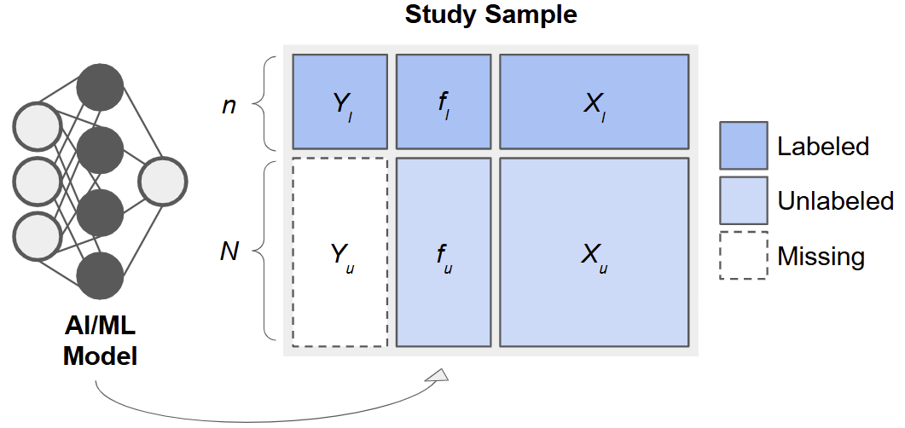

```{r, include = FALSE}
knitr::opts_chunk$set(
  echo = TRUE,
  collapse = TRUE,
  message = FALSE,
  warning = FALSE,
  comment = "#>"
)
```

## Overview

Welcome to this workshop on *Inference with Predicted Data (IPD)*! In this 
module, we will:

* Introduce the [`ipd`](https://github.com/ipd-tools/ipd) package and its main functions.
* Demonstrate how to generate synthetic data for different types of outcomes.
* Fit and compare various IPD methods.
* Inspect results using built-in `tidy`, `glance`, and `augment` methods.

Throughout the workshop, exercises are provided with solutions for practice.

## Background and Motivation

When an outcome, $Y$, is costly or difficult to measure, it can be tempting to 
replace missing values with predictions, $f(\boldsymbol{X})$, from a 
machine learning model (e.g., a random forest or neural network) built on easier-to-measure features, $\boldsymbol{X}$. However, using $f$ as if 
it were the true outcome in downstream analyses, e.g., in estimating a 
regression coefficient, $\beta$, for the association between $Y$ and 
$\boldsymbol{X}$, leads to biased point estimates and underestimated 
uncertainty. Methods for 
[Inference with Predicted Data (IPD)](https://academic.oup.com/bioinformatics/article/41/2/btaf055/7997267) 
address this by leveraging a small subset of "labeled" data with true $Y$ 
values to calibrate inference in a larger "unlabeled" dataset. 

## The IPD Framework

Consider data arising from three sets of observations:

* **Training Set**: $\{(X_j, Y_j)\}_{j=1}^{n_t}$, used to fit a predictive model, $f(\cdot)$.
* **Labeled Set**: $\{(X_i, Y_i)\}_{i=1}^{n_l}$, smaller sample with true outcomes measured.
* **Unlabeled Set**: $\{(X_i)\}_{i=n_l +1}^{n_l + n_u}$, only features available.

After fitting $f$ on the training set, we apply it to the labeled and unlabeled sets to obtain predictions $f_i = f(X_i)$:

<br/>

{width=100%}

<br/>

Especially for 'good' predictions, it is tempting to treat $f_i$ in the labeled 
and unlabeled sets as surrogate outcomes and use them to estimate quantities 
such as regression parameters, $\beta$.  However, as we will see, this leads 
to *invalid inference*. By combining the predicted $f_i$ with the observed 
$Y_i$ in the labeled set, we can calibrate our estimates and standard errors 
to achieve *valid inference*.

## Key Formulas

Consider a simple linear regression model for the association between $Y$ and 
$X$. We discuss the following potential estimators, which we will later 
implement using simulated data.

### Naive Estimator

Using only the *unlabeled* predictions, the **naive** OLS estimator solves

$$
\hat\gamma_{\text{naive}} = \arg\min_\gamma \sum_{i\in U} (f_i - X_i'\gamma)^2.
$$

We are careful to write the coefficients for this model as $\gamma$, because 
they bear no necessary correspondence with $\beta$, except under the extremely 
restrictive scenario when $f$ perfectly captures the true regression function.

### Classical Estimator

Instead, a valid approach would be to use only the *labeled* data. This 
**classical** estimator solves

$$
\hat\beta_{\text{classical}} = \arg\min_\beta \sum_{i\in L} (Y_i - X_i'\beta)^2.
$$
While this approach is valid, it has limited precision because $n_l$ is small 
in practice and we do not utilize any potential information from the (often
much larger) **unlabeled** data.

### IPD Estimators

Many estimators tailored to inference with predicted data
share a similar form, as given in 
[Ji et al. (2025)](https://arxiv.org/pdf/2501.09731):

$$
\widehat\beta_\text{ipd} = \arg\min_\beta \frac{1}{n_l}\sum_{i=1}^{n_l} \ell(X_i, Y_i) - \left[\frac{1}{n_l}\sum_{i=1}^{n_l} g(X_i, f_i) - \frac{1}{n_l+n_u}\sum_{i=n_l+1}^{n_l+n_u} g(X_i, f_i)\right],
$$

for some loss function, $\ell(\cdot)$, such as the squared error loss for 
linear regression, and some $g(\cdot)$, which they call the 'imputed loss'. 
Here, the first term is exactly the **classical** estimator, which anchors 
these methods on a valid model, and the second term in the square brackets 
'augments' the estimator with additional information from the predictions. 
This allows us to have an estimator that is provably unbiased and 
asymptotically at least as efficient as the **classical** estimator, which 
only uses a fraction of the data.

The 
[Inference with Predicted Data (IPD)](https://academic.oup.com/bioinformatics/article/41/2/btaf055/7997267) 
package implements several recent methods for IPD, such as **Chen & Chen** 
method of
[Gronsbell et al.](https://arxiv.org/pdf/2411.19908), 
the Prediction-Powered Inference (**PPI**) and **PPI++** methods of 
[Angelopoulos et al. (a)](https://www.science.org/doi/10.1126/science.adi6000) 
and 
[Angelopoulos et al. (a)](https://arxiv.org/pdf/2311.01453), the 
Post-Prediction Inference (**PostPI**) method of 
[Wang et al.](https://www.pnas.org/doi/10.1073/pnas.2001238117), and the 
Post-Prediction Adaptive Inference (**PSPA**) method of 
[Miao et al.](https://arxiv.org/abs/2311.14220) 
to conduct valid, efficient inference, even when a large proportion of outcomes 
are predicted.  

In this first tutorial, we demonstrate how to:

1. **Generate** fully synthetic data with `ipd::simdat()`.
2. **Fit** a simple linear prediction model (e.g., linear regression).
3. **Apply** `ipd::ipd()` to estimate the association, $\beta$, between $Y$ and $X$ using *labeled* and *unlabeled* data.
4. **Compare** the **naive**, **classical**, and **IPD** estimates of $\beta$.
5. **Visualize** these results.

## Installation and Setup

First, insure you have the `ipd` package and some additional packages installed:

```{r setup}
# Install these packages if you have not already:
# install.packages(c("ipd", "broom", "tidyverse", "patchwork"))

library(ipd)
library(broom)
library(tidyverse)
library(patchwork)
```

Throughout the workshop, we will use reproducible seeds and 
[tidyverse](https://www.tidyverse.org/) conventions.

## Function References

Below is a high-level summary of the core ``ipd`` functions.

### `simdat()`

Generates synthetic datasets for various inferential models.

```{r, eval=FALSE}
simdat(
  n,        # Numeric vector of length 3: c(n_train, n_labeled, n_unlabeled)
  effect,   # Numeric: true effect size for simulation
  sigma_Y,  # Numeric: residual standard deviation
  model,    # Character: one of "mean", "quantile", "ols", "logistic", "poisson"
  ...       # Additional arguments
)
```
This function returns a data.frame with columns:

* `X1, X2, ...`: covariates
* `Y`: true outcome (for training, labeled, and unlabeled subsets)
* `f`: predictions from the model (for labeled and unlabeled subsets)
* `set_label`: character indicating "training", "labeled", or "unlabeled".

### `ipd()`

Fits IPD methods for downstream inference on predicted data.

```{r, eval=FALSE}
ipd(
  formula,      # A formula: e.g., Y - f ~ X1 + X2 + ...
  method,       # Character: one of "chen", "postpi_boot", "postpi_analytic", 
                # "ppi", "ppi_all", "ppi_plusplus", "pspa"
  model,        # Character: one of "mean", "quantile", "ols", "logistic", 
                # "poisson"
  data,         # Data frame containing columns for formula and label
  label,        # Character: name of the column with set labels ("labeled" and 
                # "unlabeled")
  ...           # Additional arguments
)
```

#### Supported Methods

* **chen**: Chen and Chen estimator ([Gronsbell et al., 2025](https://arxiv.org/pdf/2411.19908))
* **postpi_analytic**: analytic post-prediction inference ([Wang et al., 2020](https://www.pnas.org/doi/10.1073/pnas.2001238117)).
* **postpi_boot**: bootstrap post-prediction inference [Wang et al., 2020](https://www.pnas.org/doi/10.1073/pnas.2001238117)).
* **ppi**: prediction-powered inference ([Angelopoulos et al., 2023](https://www.science.org/doi/10.1126/science.adi6000))
* **ppi_plusplus**: PPI++ (PPI with data-driven weighting; [Angelopoulos et al., 2024](https://arxiv.org/pdf/2311.01453))
* **ppi_a**: PPI using all data ([Gronsbell et al., 2025](https://arxiv.org/pdf/2411.19908))
* **pspa**: assumption-lean and data-adaptive post-prediction inference ([Miao et al., 2024](https://arxiv.org/pdf/2311.14220))

### Tidy Methods

* `print()` and `summary()`: display model summaries.
* `tidy()`: return a tibble of estimates and standard errors.
* `glance()`: return a one-row tibble of model-level metrics.
* `augment()`: return the original data with fitted values and residuals.

## Simulating Data

The `ipd::simdat()` function makes it easy to generate:

* A **training set** (where you fit your prediction model),
* A **labeled set** (where you observe the true $Y$),
* An **unlabeled set** (where $Y$ is *presumed missing* but you compute predictions $f$).

We supply the sample sizes, `n = c(n_train, n_label, n_unlabel)`, an effect 
size (`effect`), residual standard deviation (`sigma_Y`; i.e., how much random
noise is in the data), and a model type (`"ols"`, `"logistic"`, etc.). In this 
tutorial, we focus on a continuous outcome generated from a linear regression
model (`"ols"`). We can also optionally shift and scale the predictions (via 
the `shift` and `scale` arguments) to control how the predicted outcomes relate 
to their true underlying counterparts.

### Exercise 1: Data Generation

Let us generate a synthetic dataset for a linear model with:

* 5,000 training observations
* 500 labeled observations
* 1,500 unlabeled observations
* Effect size = 1.5
* Residual SD = 3
* Predictions shifted by 1 and scaled by 2

> **Note:** Interactive exercises are provided below. Try **writing your code** in the first chunk; **solutions** are hidden in the second chunk.

```{r}
set.seed(123)

# n_t = 5000, n_l = 500, n_u = 1500
n <- c(5000, 500, 1500)

# Effect size = 1.5, noise sd = 3, model = "ols" (ordinary least squares)
# We also shift the mean of the predictions by 1 and scale their values by 2
dat <- simdat(
  n       = n,
  effect  = 1.5,
  sigma_Y = 3,
  model   = "ols",
  shift   = 1,
  scale   = 2
)
```

```{r}
# The resulting data.frame `dat` has columns:
#  - X1, X2, X3, X4: Four simulated covariates (all numeric ~ N(0,1))
#  - Y             : True outcome (available in unlabeled set for simulation)
#  - f             : Predicted outcome (Generated internally in simdat)
#  - set_label     : {"training", "labeled", "unlabeled"}

# Quick look:
dat |> 
  group_by(set_label) |> 
  summarize(n = n()) 
```

Let us inspect the first few rows of each subset:

```{r}
# Training set
dat |>
  filter(set_label == "training") |>
  glimpse()

# Labeled set
dat |>
  filter(set_label == "labeled") |>
  glimpse()

# Unlabeled set
dat |>
  filter(set_label == "unlabeled") |>
  glimpse()
```

> **Explanation:**
>
> * Rows where `set_label == "training"` form an internal training set.  Here, `Y` is observed, but `f` is `NA`, as we learn the prediction rule in this set.
> * Rows where `set_label == "labeled"` also have both `Y` and `f`.  In practice, `f` will be generated by your own prediction model; for simulation, `simdat` does so automatically.
> * Rows where `set_label == "unlabeled"` have `Y` for posterity (but in a real‐data scenario, you would not know `Y`); `simdat` still generates `Y`, but the IPD routines will not use these. The column `f` always contains 'predicted' values.

## Fit a Linear Prediction Model

In practice, we would take the **training** portion and fit an AI/ML model to 
predict $Y$ from $(X_1, X_2, X_3, X_4)$. This is done automatically by the
`simdat` function, but for demonstration, let us fit a 
*linear prediction model* on the training data:

```{r}
# 1) Subset training set
dat_train <- dat |> 
  filter(set_label == "training")

# 2) Fit a linear model: Y ~ X1 + X2 + X3 + X4
lm_pred <- lm(Y ~ X1 + X2 + X3 + X4, data = dat_train)

# 3) Prepare a full-length vector of NA
dat$f_pred <- NA_real_

# 4) Identify the rows to predict (all non–training rows)
idx_analytic <- dat$set_label != "training"

# 5) Generate predictions just once on that subset (shifted and scaled to match)
pred_vals <- (predict(lm_pred, newdata = dat[idx_analytic, ]) - 1) / 2 

# 6) Insert them back into the full data frame
dat$f_pred[idx_analytic] <- pred_vals

# 7) Verify: `f_pred` is equal to `f` for the labeled and unlabeled data
dat |> 
  select(set_label, Y, f, f_pred) |> 
  filter(set_label != "training") |>
  glimpse()
```

> **Explanation of arguments:**
>
> * `lm(Y ~ X1 + X2 + X3 + X4, data = dat_train)` fits an ordinary least squares (OLS) regression on the training subset.
> * `predict(lm_pred, newdata = .)` generates a new `f` (stored as `f_pred`) for each row outside of the training set.

> **Note:** In real workflows, you might use random forests (`ranger::ranger()`), gradients (`xgboost::xgboost()`), or any other ML algorithm; the IPD methods only require that you supply a vector of predictions, `f`, in your data.

## Create 'Labeled' and 'Unlabeled' datasets

We now split the data into two subsets:

* **labeled**: those rows where we retain the true `Y` (to be used for final inference alongside their predictions).
* **unlabeled**: those rows where we **hide** the true `Y` (we pretend we do not observe them; `ipd` will still require the `f` + covariates).

```{r}
dat_ipd <- dat |>
  filter(set_label != "training") |>
  # Keep only the columns needed for downstream IPD
  select(set_label, Y, f, X1, X2, X3, X4) 

# Show counts:
dat_ipd |> 
  group_by(set_label) |> 
  summarize(n = n())
```

> **Explanation:**
>
> * After this step, `dat_ipd` has two groups:
>
>   * `labeled` (500 rows where we observe both `Y` and `f`),
>   * `unlabeled` (1500 rows where we only 'observe' `f`).

## Comparison of the True vs Predicted Outcomes

Before modeling, it is helpful to see graphically how the predicted values, 
$f$, compare to the true outcomes, $Y$. We can visually assess the **bias** 
and **variance** of our predicted outcomes, $f$, versus the true outcomes, 
$Y$, in our analytic data by plotting:

1. **Scatterplot** of $Y$ and $f$ vs. $X_1$  
2. **Density plots** of $Y$ and $f$  

```{r, out.width="100%", dpi=300}
# Prepare data
dat_visualize <- dat_ipd |> 
  select(X1, Y, f) |>
  pivot_longer(Y:f, names_to = "Measure", values_to = "Value") |>
  arrange(Measure)

# Scatter + trend lines
ggplot(dat_visualize, aes(x = X1, y = Value, color = Measure)) +
  theme_minimal() +
  geom_point(alpha = 0.4) +
  geom_smooth(method = "lm", se = FALSE) +
  scale_color_manual(values = c("steelblue", "gray")) +
  labs(
    x     = "X1",
    y     = "True Y or Predicted f",
    color = "Measure"
  ) +
  theme(legend.position = "bottom") 
```

```{r, out.width="100%", dpi=300}
# Density plots
ggplot(dat_visualize, aes(x = Value, fill = Measure)) +
  theme_minimal() +
  geom_density(alpha = 0.4) +
  scale_fill_manual(values = c("steelblue", "gray")) +
  labs(
    x     = "Value",
    y     = "Density",
    fill  = "Measure"
  ) +
  theme(legend.position = "bottom")
```

> **Interpretation:**
>
> In the **scatterplot**, note that the predicted values $f$ (in blue) lie more tightly along the fitted trend line than the true $Y$ (in gray), indicating stronger correlation with $X_1$.
>
> In the **density plot**, you can see that the spread of $f$ is narrower than that of $Y$, illustrating that the predictive model has reduced variance (often due to "regression to the mean").

## Some Baselines: Naive vs Classical Inference

Before applying IPD, let's see what happens if we:

1. Regress the *unlabeled* predicted `f` on `X1` (the **naive** approach).
2. Regress only the *labeled* true `Y` on `X1` (the **classical** approach).

We will compare these to IPD‐corrected estimates.

### Exercise 2: Naive vs. Classical Model Fitting

Using the `labeled` and `unlabeled` sets, fit two models:

1. **Naive OLS** on the *unlabeled* set using `lm()` with `f ~ X1`.
2. **Classical OLS** on the *labeled* set using `lm()` with `Y ~ X1`.

```{r}
# 1) Naive: treat f as if it were truth (only on unlabeled)
naive_model <- lm(f ~ X1, data = filter(dat_ipd, set_label == "unlabeled"))

# 2) Classical: regress true Y on X1, only on the labeled set
classical_model <- lm(Y ~ X1, data = filter(dat_ipd, set_label == "labeled"))
```

Let's also extract the coefficient summaries using `tidy` and compare the 
results of the two approaches:

```{r}
naive_df <- tidy(naive_model) |>
  mutate(method = "Naive") |>
  filter(term == "X1") |>
  select(method, estimate, std.error) 

classical_df <- tidy(classical_model) |>
  mutate(method = "Classical") |>
  filter(term == "X1") |>
  select(method, estimate, std.error)

bind_rows(naive_df, classical_df)
```

> **Expected behavior (interpretation):**
>
> * The **naive** coefficient is *attenuated*, or *biased* toward zero, since the predictions are imperfect.
> * The **classical** coefficient is unbiased but has a larger standard error due to the smaller sample size.

## IPD: Corrected Inference with `ipd::ipd()`

The single wrapper function `ipd()` implements multiple IPD methods (e.g., 
**Chen & Chen**, **PostPI**, **PPI**, **PPI++**, **PSPA**) for various
inferential tasks (e.g., **mean** and **quantile** estimation, **ols**, 
**logistic**, and **poisson** regression).  

> **Reminder:** Basic usage of `ipd()`:
>
> ```{r, eval=FALSE} 
> ipd(
>   formula = Y - f ~ X1,     # The downstream inferential model
>   method  = "pspa"          # The IPD method to run 
>   model   = "ols"           # The type of inferential model
>   data    = dat_ipd,        # A data.frame with columns:
>                             #   - set_label: {"labeled", "unlabeled"}
>                             #   - Y: true outcomes (for labeled data)
>                             #   - f: predicted outcomes
>                             #   - X covariates (here X1, X2, X3, X4)
>   label   = "set_label",    # Column name indicating "labeled"/"unlabeled"
> )
> ```

### Exercise 3: IPD Model Fitting via the PSPA Estimator

Let's run one method, `pspa`, proposed by [Miao et al., 2024](https://arxiv.org/pdf/2311.14220). The **PSPA** 
estimator is an IPD method that combines information from:

1. **Labeled data** (where the true outcome, $Y$, and model predictions, $f$, are available), and  
2. **Unlabeled data** (where only model predictions, $f$, are available).

Rather than treating the predicted outcomes with importance as the true 
outcomes, the method estimates a **data-driven weight**, $\hat{\omega}$, 
and applies it to the predicted outcome contributions:

$$
\hat{\beta}_{\rm pspa} = \hat{\beta}_{\rm classical} - \hat{\omega}\cdot (\hat{\gamma}_{\rm naive}^l - \hat{\gamma}_{\rm naive}^u),
$$

where $\hat{\beta}_{\rm classical}$ is the estimate from the **classical** 
regression, $\hat{\gamma}_{\rm naive}^l$ is the estimate from the **naive**
regression in the *labeled* data, $\hat{\gamma}_{\rm naive}^u$ is the estimate
from the **naive** regression in the *unlabeled* data, and 
$\hat{\omega}$ reflects the amount of additional information carried by the
predictions. By adaptively weighting the unlabeled information, the **PSPA**
estimator achieves greater precision than by using the labeled data alone, 
without sacrificing validity, even when the predictions are imperfect.  

Let's call the method using the `ipd()` function and collect the estimate for 
the slope of `X1` in a linear regression (`model = "ols"`):

```{r}
set.seed(123)
ipd_model <- ipd(
  formula = Y - f ~ X1,
  data    = dat_ipd,
  label   = "set_label",
  method  = "pspa",
  model   = "ols"
)

ipd_model
```

The `ipd_model` is an `S4` object with slots for things like the coefficient, se, 
ci, coefTable, fit, formula, data_l, data_u, method, model, and intercept. We 
can extract the coefficient table using `ipd`'s `tidy` helper and compare with
the naive and classical methods:

```{r}
# Extract the coefficient estimates
ipd_df <- tidy(ipd_model) |>
  mutate(method = "IPD") |>
  filter(term == "X1") |>
  select(method, estimate, std.error)

# Combine with naive & classical:
compare_tab <- bind_rows(naive_df, classical_df, ipd_df)
compare_tab
```

### Exercise 4: Visualizing Uncertainty

Let's plot the coefficient estimates and 95% CIs for each of the naive, classical, and IPD methods:

```{r, fig.width=6, fig.height=3}
# Forest plot of estimates and 95% confidence intervals
compare_tab |>
  mutate(
    lower = estimate - 1.96 * std.error,
    upper = estimate + 1.96 * std.error
  ) |>
  ggplot(aes(x = estimate, y = method)) +
    geom_point(size = 2) +
    geom_errorbarh(aes(xmin = lower, xmax = upper), height = 0.2) +
    geom_vline(xintercept = 1.5, linetype = "dashed", color = "red") +
    labs(
      title = "Comparison of slope estimates \u00B1 1.96·SE",
      x = expression(hat(beta)[X1]),
      y = ""
    ) +
    theme_minimal()
```

> **Interpretation:**
>
> * The dashed red line at **1.5** is the *true* data-generating effect for $X_1$.
> * Compare how far each method's interval is from 1.5, and whether 1.5 lies inside each interval.
> * 'Naive' often severely underestimates (biased); 'Classical' is unbiased but wide; IPD methods cluster around 1.5 with better coverage than 'naive,' often similar to classical but sometimes narrower.

### Exercise 5: Inspecting Results

Use `tidy()`, `glance()`, and `augment()` on `ipd_model`. Compare the 
coefficient estimate and standard error for `X1` with the naive fit.

```{r}
tidy(ipd_model)
glance(ipd_model)
augment(ipd_model) |> glimpse()

# Compare with naive
broom::tidy(naive_model)
```

## Summary and Key Takeaways

1. **Naive** regression on predicted outcomes is biased (point estimates are pulled toward zero and SEs are artificially small).
2. **Classical** regression on the labeled data alone is unbiased but inefficient when the labeled set is small.
3. IPD methods (Chen & Chen, PPI, PPI++, PostPI, PSPA) strike a balance: they use predictions to effectively enlarge sample size but adjust for prediction error to avoid bias.
4. Even with 'simple' linear prediction models, IPD corrections can drastically improve inference on downstream regression coefficients.

## Further Exploration

* Try other methods such as **PPI++** (`"ppi_plusplus"`). How do the results compare?
* Repeat the analysis for a **logistic** model by setting `model = "logistic"` in both `simdat()` and `ipd()`.

Happy coding! Feel free to modify and extend these exercises for your own data.

## References

* Salerno, Stephen, et al. "ipd: An R Package for Conducting Inference on Predicted Data." *Bioinformatics* (2025): btaf055.

---

*This is the end of the module. We hope this was informative! For question/concerns/suggestions, please reach out to ssalerno@fredhutch.org*
