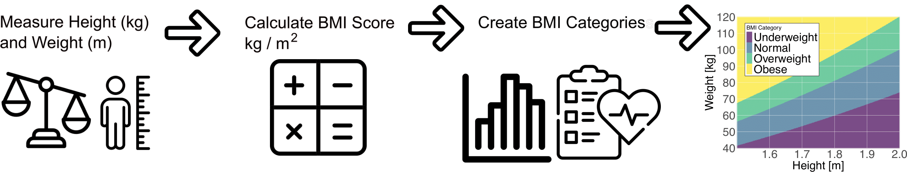

```{r, include = FALSE}
knitr::opts_chunk$set(
  echo = TRUE,
  collapse = TRUE,
  message = FALSE,
  warning = FALSE,
  comment = "#>"
)
```

## Background and Motivation

### How Do We Measure Adiposity?

Body mass index (BMI) is the most commonly used anthropometric proxy for 
adiposity in epidemiologic studies and clinical settings. It is simple to 
calculate, weight in kilograms divided by height in meters squared, and has 
well-established cut-points for classifying patients as overweight or obese. 
However, BMI does not distinguish between fat mass and lean mass, nor does it 
capture fat distribution (visceral versus subcutaneous). As a result, BMI can 
both under- and over-estimate true adiposity in key subgroups. For example 
muscular individuals (e.g., athletes) may be misclassified as "obese," while 
older adults with sarcopenia (low muscle mass) may fall below BMI thresholds 
despite having high percent body fat. 

<br>

{width=100%}

<br>

Waist circumference (WC) is another simple measure of central adiposity that 
may better reflect visceral fat, a key driver of metabolic risk. Standard WC 
cut-points (e.g., ≥ 102 cm in men, ≥ 88 cm in women) identify individuals at 
increased cardiometabolic risk, even when their BMI is in the normal or 
overweight range. Yet WC also does not directly quantify total body fat and 
is influenced by body build, posture, and measurement error.

Dual-energy X-ray absorptiometry (DXA) provides a more accurate "gold-standard" 
measure of body composition by directly quantifying total and regional fat and 
lean mass. DXA-derived percent fat thresholds (e.g., > 30% in men, > 42% in 
women) have been validated against metabolic outcomes. Comparing BMI-based 
obesity (BMI ≥ 30 kg/m²) and WC-based obesity (WC ≥ 102 cm men, ≥ 88 cm women) 
with DXA-defined obesity reveals where and how often these common 
anthropometric proxies misclassify true adiposity.

In this module, we will use data from the [National Health and Nutrition Examination Survey  (NHANES)](https://www.cdc.gov/nchs/nhanes/index.html) to:

1. **Load** BMI, WC, and DXA-based measures of adiposity and their associated 
features
2. **Define** obesity by three standards:
    - BMI (≥ 30 kg/m²)
    - Waist circumference (men ≥ 102 cm; women ≥ 88 cm)
    - DXA % body fat (> 30% men; > 42% women)
3.  **Visualize** misclassification rates overall and by age, sex, and 
race/ethnicity
4.  **Calibrate** both BMI and WC-based obesity measures to DXA using the 
`ipd` package
5.  **Discuss** implications for research and practice

By the end, we may have a better understanding of the strengths and limitations 
of BMI and WC as proxies for adiposity, know how to assess 
their sensitivity and specificity versus DXA, and be equipped to correct for 
measurement error using IPD when only BMI/WC are available.

### NHANES

The National Health and Nutrition Examination Survey 
([NHANES](https://www.cdc.gov/nchs/nhanes/index.html)) is a nationally 
representative program conducted by the U.S. Centers for Disease Control 
and Prevention that combines in-home interviews with standardized physical 
examinations and laboratory tests to assess the health and nutritional 
status of Americans. Initiated in the early 1960s and carried out continuously 
since 1999 in two-year cycles, NHANES informs public health policy, tracks 
trends in chronic conditions and risk factors, and support research on diet, 
disease, and health disparities. NHANES provides:

- **DXA-measured percent body fat** (`DXDTOPF`) for a subset of participants
- **BMI** (`BMXBMI`), derived from measured height and weight
- **Waist circumference** (`BMXWAIST`), a potential measure of central fat

As DXA scans are costly and time-consuming, many studies only record BMI and 
WC. When our scientific question involves true adiposity (e.g., its association 
with certain risk factors), but we only have BMI and WC in most participants, 
we can use `ipd` to correct our downstream inference on % body fat to account 
for the fact that these proxies are being used in place of the true DXA 
measurement.

**Note:** DXA scans were collected through the **2017 - 2018** NHANES cycle 
but were suspended during the COVID-19 pandemic. As a result, subsequent 
waves, including the **August 2021 - August 2023** data, do **not** include 
DXA measurements. In this tutorial, we will therefore:

1. Use the **2017-2018** wave as our *labeled* data (which includes `DXDTOPF`).  
2. Use **IPD** to correct our inference when estimating associations between 
% body fat and other covariates in the absence of direct DXA measurements in 
the *unlabeled* **August 2021 - August 2023** wave. 

This approach lets us leverage historic DXA data to predict adiposity in more 
recent participants, enabling unbiased inference across pre- and post-pandemic 
cohorts.

## Data Preparation and Exploration

We will now load a pre-compiled NHANES dataset, explore key variables (BMI, 
waist circumference, DXA % body fat) by cohort, and define obesity categories 
for later misclassification analyses and IPD.

### Loading the Pre-Compiled NHANES Data

For convenience, we prepared and saved a data file, `data/NHANES.rda`, which
contains a tibble, **NHANES**, with the following columns:

- `SEQN`      - Respondent ID  
- `Cohort`    - Factor: "2017-2018" or "2021-2023"  
- `Age`       - Factor: "Under 20", "20-39", "40-59", or "60+" 
- `Sex`       - Factor: "Male" or "Female"  
- `Race`      - Factor: "Non-Hispanic White", "Hispanic", "Non-Hispanic Black", "Non-Hispanic Asian", or "Other Race - Including Multi-Racial" 
- `Smoking`   - Factor: "Never Smoker", "Former Smoker", or "Current Smoker"
- `Education` - Factor: "Less than high school", "High school graduate/GED or equivalent", "Some college or AA degree", "College graduate or above", or "Refused/Unknown" 
- `BMXBMI`    - Body Mass Index (kg/m²)  
- `BMXWAIST`  - Waist Circumference (cm)  
- `DXDTOPF`   - DXA Percent Body Fat (only measured in 2017-2018; `NA` in 2021-2023)
- `WTMEC4YR`  - Four-Year Adjusted Survey Weights

**Note:** The the code used to produce this dataset is available in this 
repository at `inst/NHANES_DATA.R`.

### Install and Load the Necessary Packages

```{r}
# Install these packages if you have not already:
# install.packages(c("ipd", "broom", "scales", "tidyverse"))

library(ipd)        # Inference with predicted data
library(broom)      # Convert model objects (lm, glm, ipd) into tidy data.frames
library(scales)     # Formatting scales and labels for ggplot2
library(tidyverse)  # Meta‐package for data manipulation and visualization
```

### Load the Data

We first load the prepared dataset and take a look at its features:

```{r}
# Load the dataset
load("data/NHANES.RData")

# Inspect its structure
glimpse(NHANES)
```

### Overview by Cohort

We can now get a sense of the different cohorts and our variables of interest:

#### Sample Sizes

```{r}
NHANES |>
  count(Cohort) |>
  mutate(pct = n / sum(n) * 100)
```

#### DXA Missingness

```{r}
NHANES |>
  group_by(Cohort) |>
  summarize(
    total       = n(),
    pct_missing = mean(is.na(DXDTOPF)) * 100)
```

> **Expected:**
>
> * 2017-2018: 100% of DXA (`DXDTOPF`) present (using those with mobile examination center (MEC) tests and MEC weights).
> * 2021-2023: 100% missing for `DXDTOPF` (no DXA data post-pandemic).

### Descriptive Statistics

#### BMI, Waist Circumference, and DXA % Fat

```{r}
NHANES |>
  group_by(Cohort) |>
  summarize(
    BMI_mean = mean(BMXBMI),
    BMI_sd   = sd(BMXBMI),
    WC_mean  = mean(BMXWAIST),
    WC_sd    = sd(BMXWAIST),
    DXA_mean = mean(DXDTOPF),
    DXA_sd   = sd(DXDTOPF)
  ) |>
  pivot_longer(-Cohort)|>
  separate(name, c("Metric", "Statistic")) |>
  pivot_wider(names_from = Statistic, values_from = value)
```

#### Distributions of Continuous Measures of Adiposity

```{r, fig.width=8, fig.height=4, out.width="100%", dpi=300}
NHANES |>
  pivot_longer(c(BMXBMI, BMXWAIST, DXDTOPF)) |>
  ggplot(aes(x = value, fill = Cohort)) +
    facet_wrap(~ name, scales = "free") +
    geom_histogram(alpha = 0.6, position = "identity", bins = 30) +
    scale_fill_manual(values = c("#00C1D5", "#AA4AC4")) +
    labs(
      title = "Measures of Adiposity by Cohort", 
      x = "BMI (kg/m2), WC (cm), or % Fat", 
      y = "Count") +
    theme_minimal()
```

#### DXA vs Anthropometry in 2017-2018

Only the 2017-2018 cohort has `DXDTOPF`, so we examine how BMI and WC relate to true % body fat among the study participants in this wave:

```{r, fig.width=8, fig.height=4, out.width="100%", dpi=300}
NHANES |>
  filter(Cohort == "2017-2018") |>
  pivot_longer(c(BMXBMI, BMXWAIST)) |>
  ggplot(aes(x = value, y = DXDTOPF)) +
    facet_wrap(~ name, scales = "free_x") +
    geom_point(alpha = 0.4) +
    geom_smooth(method = "lm", color = "#1B365D") +
    labs(
      title = "DXA % Body Fat vs BMI and WC (2017-2018)",
      x = "BMI (kg/m2) or WC (cm)", y = "DXDTOPF (%)") +
    theme_minimal()
```

Let's also compare these measures by Sex. We can also add reference lines to 
see where the measure-specific obesity cut-offs would be:

```{r, fig.width=8, fig.height=4, out.width="100%", dpi=300}
cutoffs <- tibble(
  name = c("BMXBMI", "BMXBMI", "BMXWAIST", "BMXWAIST"),
  Sex  = c("Male", "Female", "Male", "Female"),
  xint = c(30, 30, 102, 88),
  yint = c(30, 42,  30, 42)
)

NHANES |>
  filter(Cohort == "2017-2018") |>
  pivot_longer(c(BMXBMI, BMXWAIST)) |>
  ggplot(aes(x = value, y = DXDTOPF, group = Sex, fill = Sex, color = Sex)) +
    facet_wrap(~ name, scales = "free_x") +
    geom_point(alpha = 0.4) +
    geom_smooth(method = "lm") +
    geom_vline(data = cutoffs, 
      aes(xintercept = xint, color = Sex), linetype = "dashed") +
    geom_hline(data = cutoffs, 
      aes(yintercept = yint, color = Sex), linetype = "dashed") +
    scale_fill_manual(values = c("#00C1D5", "#AA4AC4")) +
    scale_color_manual(values = c("#00C1D5", "#AA4AC4")) +
    labs(
      title = "DXA % Body Fat vs BMI and WC (2017-2018)",
      x = "BMI (kg/m2) or WC (cm)", y = "DXDTOPF (%)") +
    theme_minimal()
```

> **Interpretation:**
> 
> * There is a strong *positive linear relationship* between both BMI and WC with DXA body fat percentage.
> * This relationship is apparent across both sexes, but slopes differ, indicating *different body composition patterns* between males and females.
> * The presence of individuals in *mismatched quadrants* (e.g., high BMI but low body fat) suggests limitations in using BMI/WC alone as diagnostic tools, particularly across sexes.
>

## Defining Obesity Categories

Let us create three binary indicators:

* **`obese_BMI`**: BMI ≥ 30 kg/m²
* **`obese_WC`**: WC ≥ 102 cm (men) or ≥ 88 cm (women)
* **`obese_DXA`**: DXA % Fat > 30% (men) or > 42% (women)

```{r}
NHANES <- NHANES |>
  mutate(
    obese_BMI = BMXBMI >= 30,
    obese_WC  = case_when(
      Sex == "Male"   & BMXWAIST >= 102 ~ TRUE,
      Sex == "Female" & BMXWAIST >=  88 ~ TRUE,
      .default                          = FALSE),
    obese_DXA = case_when(
      is.na(DXDTOPF)                 ~ NA,
      Sex == "Male"   & DXDTOPF > 30 ~ TRUE,
      Sex == "Female" & DXDTOPF > 42 ~ TRUE,
      .default                       = FALSE)
  )
```

### Misclassification in 2017-2018

Compare BMI-defined vs DXA-defined obesity:

```{r}
# Overall
NHANES |>
  filter(Cohort == "2017-2018") |>
  count(obese_DXA, obese_BMI) |>
  mutate(percent = sprintf("%.1f%%", 100 * n / sum(n)))

# By Sex
NHANES |>
  filter(Cohort == "2017-2018") |>
  count(Sex, obese_DXA, obese_BMI) |>
  group_by(Sex) |>
  mutate(percent = sprintf("%.1f%%", 100 * n / sum(n))) |>
  ungroup()
```

And WC-defined vs DXA-defined:

```{r}
# Overall
NHANES |>
  filter(Cohort == "2017-2018") |>
  count(obese_DXA, obese_WC) |>
  mutate(percent = sprintf("%.1f%%", 100 * n / sum(n)))

# By Sex
NHANES |>
  filter(Cohort == "2017-2018") |>
  count(Sex, obese_DXA, obese_WC) |>
  group_by(Sex) |>
  mutate(percent = sprintf("%.1f%%", 100 * n / sum(n))) |>
  ungroup()
```

> **Interpretation:**
> 
> *BMI vs. DXA:*
>
> * The misclassification rate is 8.5% + 11.5% = 20.0%, with BMI underestimating DXA-defined obesity more than it overestimates it.
> * By sex, BMI misses many obese males per DXA, indicating underestimation of adiposity, but it overcalls obesity more often than it misses it in females.
> * BMI is less sensitive for men, while women are more likely to be labeled obese by BMI even when not by DXA, indicating reduced specificity.
>
> *WC vs. DXA:*
>
> * The misclassification rate is 14.6% + 8.8% = 23.4%, with WC slightly overestimating obesity more than it underestimates, opposite to BMI.
> * WC underestimates DXA-defined obesity in males, similar to BMI, but overestimates obesity in females, often classifying non-obese women as obese.
> * For women, WC has higher sensitivity but lower specificity than BMI, as it detects more DXA-obese individuals but also overcalls many who are not.

### Additional Stratified Comparisons: Grouped Bar Charts by Measure

Let us reshape the data to long format so that BMI, WC, and DXA-defined obesity 
are all in one "Measure" column:

```{r}
# Assume NHANES is already loaded and has Cohort, Age, Sex, Race, 
# and the three obesity variables
nhanes_long <- NHANES |>
  select(Cohort, Age, Sex, Race, obese_BMI, obese_WC, obese_DXA) |>
  pivot_longer(
    cols = starts_with("obese_"),
    names_to = "Measure",
    values_to = "Obese"
  ) |>
  mutate(
    Measure = recode(Measure,
      obese_BMI = "BMI",
      obese_WC  = "Waist Circumference",
      obese_DXA = "DXA"
    )
  ) |>
  filter(!is.na(Obese))
```

#### By Age Group

```{r, fig.height=4, fig.width=8, out.width="100%", dpi=300}
prop_age <- nhanes_long |>
  group_by(Cohort, Age, Measure, Obese) |>
  summarize(n = n(), .groups = "drop") |>
  group_by(Cohort, Age, Measure) |>
  mutate(prop = n / sum(n))

ggplot(prop_age, aes(x = Age, y = prop, fill = Obese)) +
  geom_col(position = "stack") +
  facet_grid(Cohort ~ Measure) +
  scale_y_continuous(labels = percent_format(accuracy = 1)) +
  scale_fill_manual(values = c("#00C1D5", "#AA4AC4")) +
  scale_color_manual(values = c("#00C1D5", "#AA4AC4")) +
  labs(
    x     = "Age Group",
    y     = "Percent",
    fill  = "Obesity Status",
    title = "Obesity Classification by Age, Cohort, and Measure"
  ) +
  theme_minimal()
```

#### By Sex

```{r, fig.height=4, fig.width=8, out.width="100%", dpi=300}
prop_sex <- nhanes_long |>
  group_by(Cohort, Sex, Measure, Obese) |>
  summarize(n = n(), .groups = "drop") |>
  group_by(Cohort, Sex, Measure) |>
  mutate(prop = n / sum(n))

ggplot(prop_sex, aes(x = Sex, y = prop, fill = Obese)) +
  geom_col(position = "stack") +
  facet_grid(Cohort ~ Measure) +
  scale_y_continuous(labels = percent_format(accuracy = 1)) +
  scale_fill_manual(values = c("#00C1D5", "#AA4AC4")) +
  scale_color_manual(values = c("#00C1D5", "#AA4AC4")) +
  labs(
    x     = "Sex",
    y     = "Percent",
    fill  = "Obesity Status",
    title = "Obesity Classification by Sex, Cohort, and Measure"
  ) +
  theme_minimal()
```

#### By Race/Ethnicity

```{r, fig.height=4, fig.width=8, out.width="100%", dpi=300}
prop_race <- nhanes_long |>
  group_by(Cohort, Race, Measure, Obese) |>
  summarize(n = n(), .groups = "drop") |>
  group_by(Cohort, Race, Measure) |>
  mutate(prop = n / sum(n))

ggplot(prop_race, aes(x = Race, y = prop, fill = Obese)) +
  geom_col(position = "stack") +
  facet_grid(Cohort ~ Measure) +
  scale_y_continuous(labels = percent_format(accuracy = 1)) +
  scale_fill_manual(values = c("#00C1D5", "#AA4AC4")) +
  scale_color_manual(values = c("#00C1D5", "#AA4AC4")) +
  labs(
    x     = "Race / Ethnicity",
    y     = "Percent",
    fill  = "Obesity Status",
    title = "Obesity Classification by Race/Ethnicity, Cohort, and Measure"
  ) +
  theme_minimal() +
  theme(axis.text.x = element_text(angle = 45, hjust = 1))
```

### Discussion

BMI misclassification varies systematically across subgroups:

-   **Age**: Young adults (18-34) often have lower lean mass, so normal-BMI individuals can still have high body fat ("normal-weight obesity").
-   **Sex**: Women generally have higher percent-fat at the same BMI; sex-specific DXA thresholds help adjust for this.
-   **Race/Ethnicity**: Differences in body composition and fat distribution mean that a single BMI cut-point may not correspond to the same adiposity level across groups.

**Implications**: Reliance on BMI alone can bias epidemiologic associations with true adiposity-driven outcomes (e.g., diabetes, cardiovascular disease). When DXA or other body-composition measures are impractical, consider calibration equations or subgroup-specific BMI thresholds.

**Next:** we will split the combined NHANES data into **labeled** (2017-2018 with `DXDTOPF`) and **unlabeled** (2021-2023 without DXA), and then proceed with IPD using BMI or WC as our proxy.

## Demographic Associations: Naive vs Classical vs IPD

### Naive vs Classical vs IPD Inference

We are interested in studying the *association* between *true percent body fat* 
(DXA % fat) and risk factors such as age, sex, and race. We model the *binary*
obesity outcome (DXA-defined "true" vs BMI/WC "proxy") as a function of *Age*, 
*Sex*, and *Race* using logistic regression:

- **Naive:** proxy-only model on *unlabeled* data (2021-2023)  
- **Classical:** true-only model on *labeled* data (2017-2018)  
- **IPD:** combine both while correcting for proxy error

#### Setup Labeled vs Unlabeled Data

```{r}
# Split NHANES into labeled (DXA available) vs unlabeled
labeled   <- NHANES |> filter(Cohort == "2017-2018")
unlabeled <- NHANES |> filter(Cohort == "2021-2023")

# Stack for IPD
combined <- bind_rows(
  labeled   |> mutate(set_label = "labeled"),
  unlabeled |> mutate(set_label = "unlabeled")
)
```

#### Naive versus Classical Regressions

We fit:

* **Naive-BMI:**   `lm(BMI ~ Age + Sex + Race,   data = unlabeled)`
* **Naive-WC:**    `lm(WC  ~ Age + Sex + Race,   data = unlabeled)`
* **Classical:**   `lm(DXDTOPF ~ Age + Sex + Race, data = labeled)`

For the naive method, we treat BMI- and WC-based obesity (our 'predictions) as 
the true outcomes, fit on the **unlabeled** participants:

```{r}
# Naive on unlabeled using BMI
naive_bmi_fit <- glm(obese_BMI ~ Age + Sex + Race, 
  family = binomial, data = unlabeled)
naive_bmi_df  <- broom::tidy(naive_bmi_fit) |>
  mutate(method = "Naive (BMI)")

# Naive on unlabeled using WC
naive_wc_fit <- glm(obese_WC ~ Age + Sex + Race,
  family = binomial, data = unlabeled)
naive_wc_df  <- broom::tidy(naive_wc_fit) |>
  mutate(method = "Naive (WC)")
```

> **Interpretation:**
>
> -   Because we 'predicted' obesity using BMI or WC, the "naive" coefficient are ...

For the classical approach, we fit the true model on the **labeled** subset (with actual DXA % fat). That is:

```{r, fig.height=6, fig.width=8, out.width="100%", dpi=300}
# Classical on labeled using DXA
class_fit <- glm(obese_DXA ~ Age + Sex + Race,
  family = binomial, data = labeled)
class_df  <- broom::tidy(class_fit) |>
  mutate(method = "Classical (DXA)")

# Combine
coef_df <- bind_rows(naive_bmi_df, naive_wc_df, class_df) |>
  filter(term != "(Intercept)") |>
  mutate(
    term = recode(term,
      "Age20-39" = "Age 20-39 (vs Under 20)",
      "Age40-59" = "Age 40-59 (vs Under 20)",
      "Age60+"   = "Age 60+ (vs Under 20)",
      "SexFemale" = "Female (vs Male)",
      "RaceNon-Hispanic Black" = "Non-Hispanic Black (vs Non-Hispanic White)",
      "RaceNon-Hispanic Asian" = "Non-Hispanic Asian (vs Non-Hispanic White)",
      "RaceHispanic" = "Hispanic (vs Non-Hispanic White)",
      "RaceOther Race - Including Multi-Racial" = "Other Race - Including Multi-Racial (vs Non-Hispanic White)"
    ),
    method = factor(method, levels = c("Classical (DXA)", "Naive (BMI)", "Naive (WC)"))
  )
    
# Forest plot
ggplot(coef_df, aes(x = estimate, y = term, color = method)) +
  geom_point(position = position_dodge(width = 0.6)) +
  geom_errorbarh(aes(xmin = estimate - 1.96 * std.error,
                     xmax = estimate + 1.96 * std.error),
                 height = 0.2,
                 position = position_dodge(width = 0.6)) +
  geom_vline(xintercept = 0, linetype = "dashed") +
  scale_y_discrete(limits = rev) +
  scale_fill_manual(values  = c("#1B365D", "#00C1D5", "#AA4AC4")) +
  scale_color_manual(values = c("#1B365D", "#00C1D5", "#AA4AC4")) +
  labs(
    x = "Log-Odds Estimate (95% CI)",
    y = "Covariate",
    title = "Comparison of Obesity Model Coefficients",
    color = "Model Type"
  ) +
  theme_minimal()
```

> **How to interpret these results?**
>
> * Notice the differences in significance and magnitude, even direction/sign change depending on the measure of obesity used!
>
> * *Age Groups (vs Under 20):* All age groups have positive coefficients, indicating higher odds of DXA-defined obesity with age, but naive BMI and WC show even larger positive estimates, suggesting that BMI and WC may over-classify obesity in older adults compared to DXA.
>
> * *Sex (Female vs Male):* DXA shows a negative association, while BMI and WC have uch larger effect sizes, particularly for WC, implying that WC-based obesity strongly overclassifies women as obese relative to DXA.
>
> * *Race/Ethnicity (vs Non-Hispanic White):* BMI/WC models show larger effects in Non-Hispanic Black participants, again hinting that BMI and WC may overestimate obesity in this group, while the opposite is true for Non-Hispanic Asian participants.

#### IPD Corrections

We now apply **IPD** to leverage all participants (labeled + unlabeled) while adjusting for prediction error. We run two IPD analyses, one using `BMI` as our '`f`' and one using `WC`.

> **A note on two calling styles:**
>
> We can either provide a single, *combined* dataset to the `data` argument and the name of the column that gives the set labels in `label`:
>
>```r
> ipd_bmi_1 <- ipd(
>   formula = obese_DXA - obese_BMI ~ Age + Sex + Race,
>   data    = combined,
>   label   = "set_label",
>   model   = "logistic",
>   method  = "pspa"
> )
> ```
>
> **or** we can provide the *labeled* set to `data` and the *unlabeled* set to `unlabeled_data` separately:
>
> ```r
> ipd_bmi_2 <- ipd(
>   formula        = obese_DXA - obese_BMI ~ Age + Sex + Race,
>   data           = labeled,
>   unlabeled_data = unlabeled,
>   model          = "logistic",
>   method         = "pspa"
> )
> ```

Now we can try to run the IPD model:

```{r, error = TRUE, warning = TRUE}
# Note: This code chunk results in an error, but we have an informative warning
# We can run it and see!
ipd_bmi_fit <- ipd(
    formula = obese_DXA - obese_BMI ~ Age + Sex + Race,
    method  = "pspa",
    model   = "logistic",
    data    = combined,
    label   = "set_label"
)

ipd_wc_fit <- ipd(
    formula = obese_DXA - obese_WC ~ Age + Sex + Race,
    method  = "pspa",
    model   = "logistic",
    data    = labeled,
    unlabeled_data = unlabeled
)
```

> **We get an informative warning:**
>
> Warning in .warn_differing_levels(inp\$data_l, inp\$data_u, factor_vars):
> Differing factor levels between labeled and unlabeled data:
>
> Warning:  - Age:
>     labeled = [Under 20, 20-39, 40-59]
>     unlabeled = [Under 20, 20-39, 40-59, 60+]
>

We can see that the *labeled* subset does *not* include any `"60+"` observations, but IPD expects the same factor levels in both sets in order to fit the model using all the data. To fix this, let us refactor both the *labeled* and *unlabeled* data so they have consistent age categories:

```{r}
# Recode age
NHANES <- NHANES |>
  mutate(Age_recode = fct_collapse(Age, `40+` = c("40-59", "60+")))
      
# Split NHANES into labeled (DXA available) vs unlabeled
labeled   <- NHANES |> filter(Cohort == "2017-2018")
unlabeled <- NHANES |> filter(Cohort == "2021-2023")

# Stack for IPD
combined <- bind_rows(
  labeled   |> mutate(set_label = "labeled"),
  unlabeled |> mutate(set_label = "unlabeled")
)
```

Now let us rerun `ipd::ipd()` and compare our results to the **Naive** and 
**Classical** models:

```{r}
# Note: This code chunk now runs without error!
ipd_bmi_fit <- ipd(
    formula = obese_DXA - obese_BMI ~ Age_recode + Sex + Race,
    method  = "pspa",
    model   = "logistic",
    data    = combined,
    label   = "set_label"
)

ipd_wc_fit <- ipd(
    formula = obese_DXA - obese_WC ~ Age_recode + Sex + Race,
    method  = "pspa",
    model   = "logistic",
    data    = labeled,
    unlabeled_data = unlabeled
)

# Collect results using the tidy() method
ipd_bmi_df <- tidy(ipd_bmi_fit) |>
  mutate(method = "IPD (BMI)")

ipd_wc_df  <- tidy(ipd_wc_fit) |>
  mutate(method = "IPD (WC)")
```

```{r, fig.height=6, fig.width=8, out.width="100%", dpi=300}
# Rerun previous models
# Naive on unlabeled using BMI
naive_bmi_fit <- glm(obese_BMI ~ Age_recode + Sex + Race, 
  family = binomial, data = unlabeled)
naive_bmi_df  <- broom::tidy(naive_bmi_fit) |>
  mutate(method = "Naive (BMI)")

# Naive on unlabeled using WC
naive_wc_fit <- glm(obese_WC ~ Age_recode + Sex + Race,
  family = binomial, data = unlabeled)
naive_wc_df  <- broom::tidy(naive_wc_fit) |>
  mutate(method = "Naive (WC)")

# Classical on labeled using DXA
class_fit <- glm(obese_DXA ~ Age_recode + Sex + Race,
  family = binomial, data = labeled)
class_df  <- broom::tidy(class_fit) |>
  mutate(method = "Classical (DXA)")

# Combine
coef_df <- bind_rows(
  ipd_bmi_df, ipd_wc_df, naive_bmi_df, naive_wc_df, class_df) |>
  filter(term != "(Intercept)") |>
  mutate(
    term = recode(term,
      "Age_recode20-39" = "Age 20-39 (vs Under 20)",
      "Age_recode40+" = "Age 40+ (vs Under 20)",
      "SexFemale" = "Female (vs Male)",
      "RaceNon-Hispanic Black" = "Non-Hispanic Black (vs Non-Hispanic White)",
      "RaceNon-Hispanic Asian" = "Non-Hispanic Asian (vs Non-Hispanic White)",
      "RaceHispanic" = "Hispanic (vs Non-Hispanic White)",
      "RaceOther Race - Including Multi-Racial" = "Other Race - Including Multi-Racial (vs Non-Hispanic White)"
    ),
    method = factor(method, 
      levels = c("IPD (BMI)", "IPD (WC)", 
                 "Classical (DXA)", "Naive (BMI)", "Naive (WC)"))
  )
    
# Forest plot
ggplot(coef_df, aes(x = estimate, y = term, 
    color = method, fill = method, shape = method)) +
  geom_point(position = position_dodge(width = 0.6)) +
  geom_errorbarh(aes(xmin = estimate - 1.96 * std.error,
                     xmax = estimate + 1.96 * std.error),
                 height = 0.2,
                 position = position_dodge(width = 0.6)) +
  geom_vline(xintercept = 0, linetype = "dashed") +
  scale_y_discrete(limits = rev) +
  scale_fill_manual(
    values = c(
      "Classical (DXA)" = "#1B365D", 
      "Naive (BMI)"     = "#00C1D5", 
      "Naive (WC)"      = "#AA4AC4",
      "IPD (BMI)"       = "#00C1D5",
      "IPD (WC)"        = "#AA4AC4"
    )
  ) +
  scale_color_manual(
    values = c(
      "Classical (DXA)" = "#1B365D", 
      "Naive (BMI)"     = "#00C1D5", 
      "Naive (WC)"      = "#AA4AC4",
      "IPD (BMI)"       = "#00C1D5",
      "IPD (WC)"        = "#AA4AC4"
    )
  ) +
  scale_shape_manual(
    values = c(
      "Classical (DXA)" = 16, 
      "Naive (BMI)"     = 16, 
      "Naive (WC)"      = 16,
      "IPD (BMI)"       = 17,
      "IPD (WC)"        = 17
    )
  ) +
  labs(
    x = "Log-Odds Estimate (95% CI)",
    y = "Covariate",
    title = "Comparison of Obesity Model Coefficients",
    color = "Model Type", fill = "Model Type", shape = "Model Type"
  ) +
  theme_minimal()
```

>
> **Key Point:** The IPD methods combine both cohorts, using the labeled DXA values and the proxy in the unlabeled cohort to correct bias and recover valid estimates for the effect of Age, Sex, and Race/Ethnicity on true adiposity.
>

## Summary and Key Takeaways

- **BMI** and **WC** are imperfect proxies for DXA-based % body fat. 
- **Naive** regression on BMI or WC leads to biased estimates for associations between obesity and risk factors such as age, sex, and race.
- **Classical** regression on true DXA-based % fat is unbiased but costly.
- **IPD** allows you to leverage a *large cohort with only BMI + covariates*, correct for prediction error, and recover unbiased estimates with more precision than the **Classical** approach.
- Understanding how different *proxies* like BMI and WC affect **population-level inference** is important for epidemiologic and clinical studies.

## References

* Visokay, Adam, et al. "How to measure obesity in public health research? Problems with using BMI for population inference." *medRxiv* (2025): 2025-04.

---

*This is the end of the module. We hope this was informative! For question/concerns/suggestions, please reach out to ssalerno@fredhutch.org*
